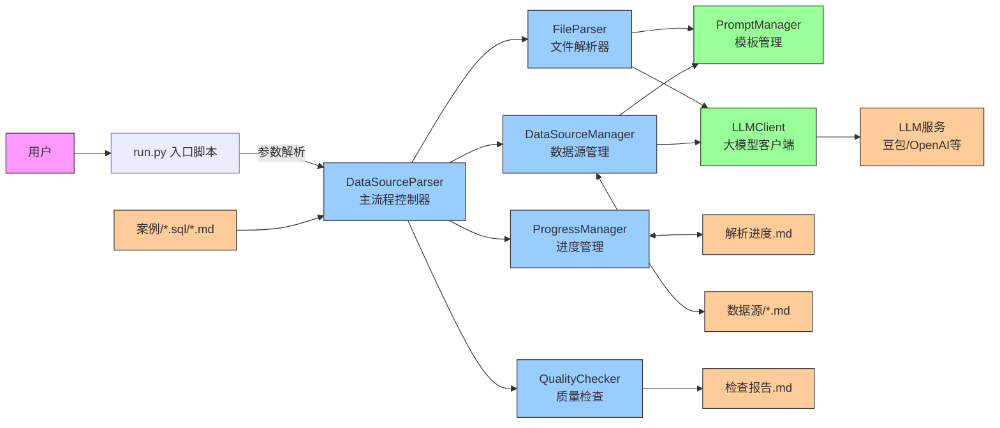

# SQL数据源解析工程

## 项目介绍
自动解析案例目录下的.sql/.md文件，通过LLM生成标准化的数据源知识索引文件，支持增量更新和智能合并。

## 核心优势
1. **端到端LLM解析**：直接将完整源文件输入LLM，避免中间处理损失信息，解析质量更高
2. **智能合并策略**：更新数据源时采用分块合并，避免上下文窗口爆炸
3. **断点续传**：解析进度自动保存，中断后可继续处理未完成的文件
4. **自动质量校验**：内置重复检测和完整性检查，生成质量报告

## 系统架构与执行流程

### 系统架构图


### 执行流程图
```mermaid
flowchart TD
    %% 启动入口
    A[用户执行命令<br>python run.py [--full]] --> B[加载.env环境配置<br>初始化LLM连接]

    %% 模式判断
    B --> C{运行模式判断}
    C -->|默认增量模式| D[读取解析进度文件<br>获取已处理文件列表]
    C -->|--full 全量模式| E[重置所有进度<br>将已处理文件移回待解析列表]

    %% 文件扫描
    D & E --> F[扫描案例目录<br>获取所有 .sql/.md 文件]

    %% 生成待处理列表
    F --> G[生成待处理文件列表<br>增量模式自动跳过已处理文件]
    G --> H{是否有待处理文件?}
    H -->|否| Q[质量检查阶段]
    H -->|是| I[逐个处理待解析文件]

    %% 单个文件处理流程
    I --> J[读取文件内容]
    J --> K{文件类型判断}
    K -->|.md| L[调用parse_md模板<br>发送给LLM解析]
    K -->|.sql| M[调用parse_sql模板<br>发送给LLM解析]

    L & M --> N[接收LLM返回的结构化JSON<br>自动修复JSON格式问题]
    N --> O[提取数据源列表<br>识别业务域]

    %% 数据源处理
    O --> P{数据源已存在?<br>全局搜索所有业务域}
    P -->|是| R[调用智能合并逻辑<br>更新已有数据源文件]
    P -->|否| S[在对应业务域下<br>创建新数据源文件]

    R & S --> T[更新解析进度<br>记录操作日志]
    T --> I[处理下一个文件]

    %% 质量检查阶段
    Q --> U[扫描所有数据源文件<br>检测重复数据源]
    U --> V[生成质量检查报告]
    V --> W{有重复数据源?}
    W -->|是| X[自动合并重复数据源<br>更新进度记录]
    W -->|否| Y[流程结束]
    X --> Y[流程结束]

    %% 样式设置
    classDef startend fill:#f9f,stroke:#333,stroke-width:2px;
    classDef decision fill:#ff9,stroke:#333,stroke-width:2px;
    classDef process fill:#9f9,stroke:#333,stroke-width:2px;
    class A,Y startend;
    class C,H,K,P,W decision;
    class B,D,E,F,G,I,J,L,M,N,O,R,S,T,U,V,X process;
```

## 快速开始

### 1. 安装依赖
```bash
pip install -r requirements.txt
```

### 2. 配置环境变量
```bash
cp .env.example .env
# 编辑.env文件，配置LLM API密钥等信息
```

### 3. 准备案例文件
将需要解析的.sql和.md文件放在`案例/`目录下，按业务域分类存放。

### 4. 运行解析
```bash
# 增量解析（默认，仅处理新增/未处理的文件）
python run.py

# 全量解析（重新处理所有文件，覆盖之前的进度）
python run.py --full
# 或者
python run.py --force
```

### 5. 仅运行质量检查
```bash
# 仅检查，不自动合并
python run.py check

# 检查并自动合并重复数据源
python run.py merge
```

## 输出说明
- `数据源/`目录下按业务域分类存放解析后的数据源文件
- `数据源/解析进度.md`：解析进度和记录
- `数据源/检查报告.md`：质量检查报告

## 项目结构
```
├── 案例/                 # 待解析的案例文件目录
├── 数据源/               # 解析结果输出目录
├── config/              # 配置管理
├── prompts/             # LLM Prompt模板
├── src/                 # 源代码
│   ├── main.py          # 主流程
│   ├── parser.py        # 文件解析器
│   ├── llm_client.py    # LLM客户端
│   ├── data_source_manager.py # 数据源管理
│   ├── progress_manager.py    # 进度管理
│   └── quality_checker.py     # 质量检查
├── tests/               # 单元测试
├── run.py               # 项目入口
├── requirements.txt     # 依赖
└── .env                 # 环境变量配置
```

## 优化点
- 支持批量处理时的并发控制
- 增加解析结果的人工审核流程
- 支持更多类型的源文件解析
- 可扩展支持其他LLM模型
